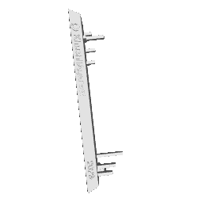

# Hello World! 👋 from Khushi Agarwal
#### A Data and AI Engineer 🤓 aspiring to learn. 👩🏻‍💻

  
  

### Tools 🔨 & Technologies 💻 I know     
  
  
 Programming Languages ©️ 

  

    
    
     
    
    
      
               
   
  
      
       
 
  

  
Backend Database 🔙 
    

     
    
    
   
   
   

  

 
 Big Data & Cloud Coumputing 🔄 
 
   
 
       
       
       
       
       
       
      
  
    
              
   

  

  
 Machine Learning Libraries 🤖 

  

   
   
         
   
   
    
        
    
    
  
  

  
 My Github Stats 

  

 
<!--   style="border-radius: 5px;" -->

   

 
  <!--  -->
  

         

        
  
    
  

  
  
  

