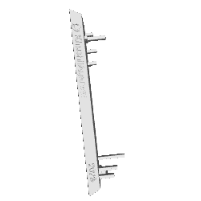

### Hello World 👋 I am Khushi Agarwal
<h6 align="left">
🔭 I’m currently working on Python projects in AI 🌱 I’m currently learning Cloud Computing and Web Development  💬 Ask me about C and Python</h6>

### Technologies I know
 

    
    
    
    
    
    
     
        
    
    
    
    
    
    
    
     
    
    
    
    
    
    
    
     
    
               
   
    
    
    
    
         

 

  
  
      

 
  <!--  -->
  

   
     
  
  

 

  

  
  
  

  

